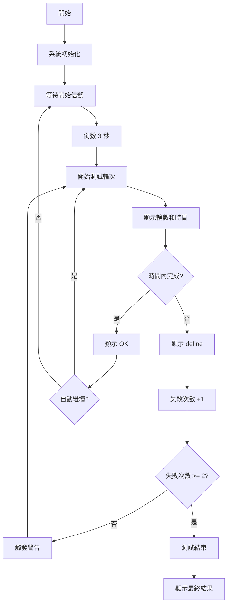

# Interval Shuttle Run Assistant | 間歇折返跑輔助器

## 專案簡介 | Project Description

**間歇折返跑輔助器**是一個基於 Arduino 的智能測試設備，專門用於協助進行間歇折返跑測試。本系統透過超音波感測器自動檢測跑者距離，結合 LCD 顯示器、LED 指示燈和蜂鳴器，提供完整的測試流程管理和即時回饋。

**Interval Shuttle Run Assistant** is an Arduino-based intelligent testing device designed to assist in interval shuttle run tests. The system automatically detects runner distances using ultrasonic sensors, combined with LCD display, LED indicators, and buzzer to provide complete test process management and real-time feedback.

## 功能特色 | Features

### 🏃‍♂️ 智能距離檢測
- 使用 HC-SR04 超音波感測器精確測量距離
- 自動檢測跑者是否完成折返跑（距離 < 50cm）
- 支援即時距離監控

### ⏱️ 動態時間管理
- 智能時間計算：前 6 次為 9 秒，之後每次遞減 0.5 秒
- 最低時間限制：5 秒（確保測試安全性）
- 即時倒數計時顯示

### 🔔 多重警告系統
- **黃燈警告**：第一次失敗時亮起，蜂鳴器 1000Hz 響 2 秒
- **紅燈警告**：第二次失敗時亮起，蜂鳴器 2000Hz 響 2 秒
- **累計失敗**：兩次失敗後自動結束測試

### 📱 人機互動介面
- 16x2 LCD 顯示器顯示測試狀態
- Serial 通訊支援，可通過電腦控制
- 一鍵重啟測試功能（發送 'S' 或 's'）

## 硬體需求 | Hardware Requirements

| 元件 | 型號/規格 | 數量 | 用途 |
|------|-----------|------|------|
| 微控制器 | Arduino Uno/Nano | 1 | 主控制器 |
| 超音波感測器 | HC-SR04 | 1 | 距離檢測 |
| LCD 顯示器 | 16x2 I2C LCD (0x27) | 1 | 資訊顯示 |
| 蜂鳴器 | 有源蜂鳴器 | 1 | 聲音提示 |
| LED 指示燈 | 黃色 LED | 1 | 第一次失敗警告 |
| LED 指示燈 | 紅色 LED | 1 | 第二次失敗警告 |
| 電阻 | 220Ω | 2 | LED 限流電阻 |
| 跳線 | 杜邦線 | 若干 | 電路連接 |

## 接線圖 | Wiring Diagram

```
Arduino Uno    →    元件
Pin 3         →    HC-SR04 Trigger
Pin 4         →    HC-SR04 Echo
Pin 5         →    Buzzer (+)
Pin 6         →    Yellow LED (through 220Ω resistor)
Pin 7         →    Red LED (through 220Ω resistor)
A4 (SDA)      →    LCD SDA
A5 (SCL)      →    LCD SCL
5V            →    HC-SR04 VCC, LCD VCC
GND           →    所有元件 GND
```

## 使用說明 | Usage Instructions

### 初始設置
1. 上傳程式碼到 Arduino 開發板
2. 確認所有硬體連接正確
3. 開啟 Serial Monitor（波特率：9600）

### 測試流程
1. **開始測試**：系統自動啟動或發送 'S'/'s' 字符重啟
2. **倒數階段**：LCD 顯示 "start!" 並倒數 3 秒
3. **測試執行**：
   - LCD 顯示當前輪數和剩餘時間
   - 跑者需在時間內完成折返跑（到達 50cm 內）
   - 系統自動檢測並給出結果
4. **結果反饋**：
   - 成功：顯示 "OK!" 
   - 失敗：顯示 "define!" 並觸發相應警告
5. **測試結束**：兩次失敗後顯示 "finish" 和總輪數

### 時間計算規則
- 第 1-6 輪：每輪 9 秒
- 第 7 輪開始：9 - 0.5×(輪數-6) 秒
- 最短時間：5 秒

## 專案文件 | Project Files

- `sketch_suc.ino` - Arduino 主程式
- `成果展示圖1-5.jpg` - 系統展示圖片
- `流程圖.jpg` - 系統流程圖
- `間歇折返跑輔助器_展示影片.mp4` - 功能演示影片
- `間歇折返跑輔助器.xlsx` - 專案規劃文件

## 系統流程 | System Flow



## 技術特點 | Technical Features

- **非阻塞式程式設計**：使用狀態機確保系統響應性
- **精確時間控制**：0.1 秒精度的倒數計時
- **容錯處理**：超時檢測和異常狀態處理
- **模組化設計**：功能分離，易於維護和擴展

## 未來改進 | Future Improvements

- [ ] 新增 Wi-Fi 連接功能，支援遠端監控
- [ ] 整合 SD 卡模組，記錄測試數據
- [ ] 開發手機 App 進行測試管理
- [ ] 新增語音提示功能
- [ ] 支援多人同時測試

## 作者 | Authors

此專案為期末報告作品，展示了 Arduino 在體育測試輔助設備中的應用。
